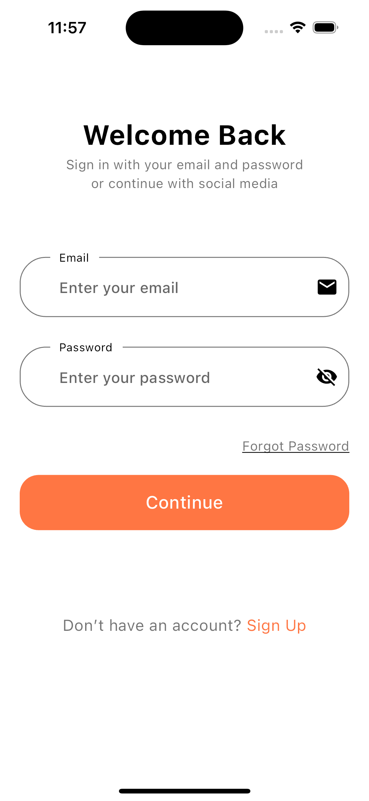
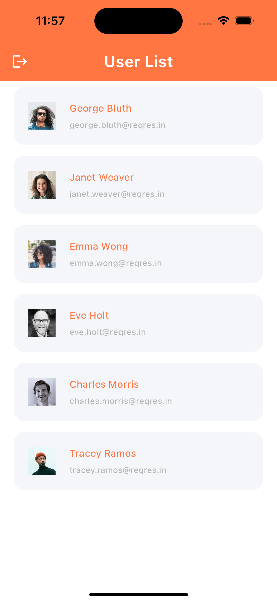

# Flutter Template

A Flutter template project for a simple user list app.

## Screenshots

### Splash Screen

<div align="center">
  <br />
  
</div>

### Login Screen

<div align="center">
  <b>Login Screen</b>
  <br />
  
</div>

### User List Screen

<div align="center">
  <b>User List Screen</b>
  <br />
  
</div>

## Getting Started

After installing the package dependencies with:

```bash
flutter pub get
